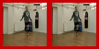
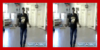

# Self-Supervised Model for Video Prediction and Unsupervised Action Recognition

## Task Scripts:

 - ```train_video_prediction_ucf101.py``` - Trains a model for the task of video prediction on the UCF101
  - ```train_video_prediction_bouncing_ball.py``` - Trains a model for the task of video prediction on the Bouncing Ball dataset
 - ```build_classification_dataset.py``` - Runs videos through the trained video prediction model and stores the intermediate tensors to be used for classifying actions
 - ```train_video_classification.py``` - Use the saved intermediate tensors and classify actions.
 - ```generate_gif.py``` - Iterates through a few videos of the dataset and generates 6 image frames :- 3 seed frames and 3 predicted frames.
 - ```tune_hyperparams.py``` - Hyperparameter tuning using Ray Tune
 
## Configuration:

  - ```resources/config/user-{linux_or_windows_user}.json``` - create a similar configuration file specifying the UCF101 dataset location, number of workers for processing, classification dataset directory, etc
  - ```resources/remote-sync-templace.json``` - to sync with a remote machine to run experiments, accompanying scripts can be found in `utils/`

## Instructions to run script:

1. Make sure you have created a user config.

2. Please set the `PYTHONPATH` environment variable in order to run the scripts.

3. You can execute each script by calling `python script_file.py`

## Sample Output
### TinyUCF
Close to original<br>





Suboptimal<br>


### Bouncing Balls


